# FT-DVRMS Architecture Workflow

COMP 6231 -- Distributed System Design, Winter 2026, Concordia University

---

## Table of Contents

1. [High-Level Architecture](#1-high-level-architecture)
2. [Message Protocol Reference](#2-message-protocol-reference)
3. [Normal Request Flow](#3-normal-request-flow)
4. [Front End (FE) Component Design](#4-front-end-fe-component-design)
5. [Sequencer Component Design](#5-sequencer-component-design)
6. [Replica (RE) Component Design](#6-replica-re-component-design)
7. [Replica Manager (RM) Component Design](#7-replica-manager-rm-component-design)
8. [Failure Simulation Design](#8-failure-simulation-design)
9. [Demo Scenarios Reference](#9-demo-scenarios-reference)
10. [Port Map and Process Topology](#10-port-map-and-process-topology)

---

## 1. High-Level Architecture

### 1.1 System Overview

FT-DVRMS is a fault-tolerant distributed vehicle reservation management system built on **active (state machine) replication** with **4 replicas**. It extends an Assignment 3 JAX-WS vehicle reservation service into a highly available system that tolerates simultaneous **1 non-malicious Byzantine fault + 1 crash fault**.

Three rental offices -- Montreal (MTL), Winnipeg (WPG), and Banff (BNF) -- serve customers and managers through a single Front End that provides **replication transparency**: clients interact via SOAP as if talking to a single server.

### 1.2 Fault Model

| Parameter | Value |
|---|---|
| Total replicas | 4 |
| Max Byzantine faults | 1 |
| Max crash faults | 1 |
| Simultaneous tolerance | 1 Byzantine + 1 crash |
| Matching threshold (f+1) | 2 identical results = correct |
| Sequencer assumption | Single instance, failure-free |

With 4 replicas, even under worst case (1 crashed, 1 Byzantine), 2 correct replicas still respond identically, meeting the `f+1 = 2` matching requirement.

### 1.3 Kaashoek Sequencer-Based Total Ordering

All replicas execute the same operations in the same global order using a centralized Sequencer:

1. FE sends each client request **only to the Sequencer**
2. Sequencer assigns a monotonically increasing sequence number
3. Sequencer reliably multicasts `EXECUTE` + seq# to all 4 replicas
4. Each replica applies operations in sequence-number order using a holdback queue

### 1.4 Component Overview

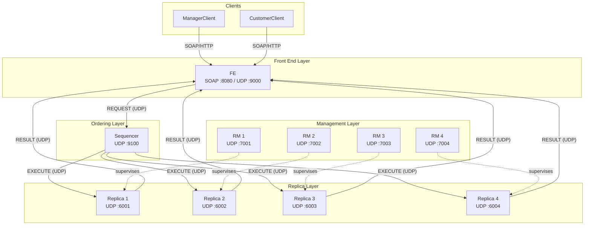

### 1.5 Communication Model

| Path | Protocol | Transport |
|---|---|---|
| Client to FE | SOAP/HTTP (JAX-WS) | TCP :8080 |
| FE to Sequencer | `ReliableUDPSender` | UDP :9100 |
| Sequencer to Replicas | `ReliableUDPSender` (parallel) | UDP :6001--6004 |
| Replicas to FE | `ReliableUDPSender` | UDP :9000 |
| FE to all RMs | `ReliableUDPSender` | UDP :7001--7004 |
| RM to RM (peer votes) | `ReliableUDPSender` | UDP :7001--7004 |
| RM to Sequencer | `ReliableUDPSender` | UDP :9100 |
| RM to co-located Replica | Raw UDP | UDP :600x |
| Inter-office (within replica) | Raw UDP | UDP :50xx |

### 1.6 Wire Protocol

All server-side messages use colon-delimited strings parsed by `UDPMessage`:

```
TYPE:field1:field2:field3:...
```

`UDPMessage.parse("EXECUTE:0:REQ-1:localhost:9000:ADDVEHICLE:MTLM1111:5:Sedan:MTLV0001:100.0")` produces a message with `type = EXECUTE` and 10 fields.

---

## 2. Message Protocol Reference

### 2.1 Core Flow Messages

| Type | Direction | Wire Format | Purpose |
|---|---|---|---|
| `REQUEST` | FE -> Sequencer | `REQUEST:<reqID>:localhost:<fePort>:<operation>` | Client operation forwarded for ordering |
| `EXECUTE` | Sequencer -> Replicas | `EXECUTE:<seqNum>:<reqID>:<feHost>:<fePort>:<operation>` | Ordered operation for replica execution |
| `RESULT` | Replica -> FE | `RESULT:<seqNum>:<reqID>:<replicaID>:<payload>` | Business result from replica |
| `ACK` | Any -> Sender | `ACK:<token>` | Delivery confirmation |
| `NACK` | Replica -> Sequencer | `NACK:<replicaID>:<seqStart>:<seqEnd>` | Gap detected, request replay |

### 2.2 Failure Handling Messages

| Type | Direction | Wire Format | Purpose |
|---|---|---|---|
| `INCORRECT_RESULT` | FE -> all RMs | `INCORRECT_RESULT:<reqID>:<seqNum>:<replicaID>` | Per-request mismatch notification |
| `CRASH_SUSPECT` | FE/Sequencer -> all RMs | `CRASH_SUSPECT:<reqID>:<seqNum>:<replicaID>` | Replica did not respond |
| `REPLACE_REQUEST` | FE -> all RMs | `REPLACE_REQUEST:<replicaID>:BYZANTINE_THRESHOLD` | 3 Byzantine strikes reached |

### 2.3 RM Coordination Messages

| Type | Direction | Wire Format | Purpose |
|---|---|---|---|
| `VOTE_BYZANTINE` | RM -> all RMs | `VOTE_BYZANTINE:<targetID>:<voterID>` | Implicit AGREE vote for Byzantine replacement |
| `VOTE_CRASH` | RM -> all RMs | `VOTE_CRASH:<targetID>:<ALIVE\|CRASH_CONFIRMED>:<voterID>` | Crash verification verdict |
| `SHUTDOWN` | RM -> Replica | `SHUTDOWN:<replicaID>` | Graceful replica termination |
| `REPLICA_READY` | RM -> Sequencer/FE/RMs | `REPLICA_READY:<replicaID>:localhost:<port>:<lastSeqNum>` | Replacement replica is operational |

### 2.4 Heartbeat Messages

| Type | Direction | Wire Format | Purpose |
|---|---|---|---|
| `HEARTBEAT_CHECK` | RM -> Replica | `HEARTBEAT_CHECK:<replicaID>` | Liveness probe |
| `HEARTBEAT_ACK` | Replica -> RM | `HEARTBEAT_ACK:<replicaID>:<nextExpectedSeq>` | Liveness confirmation with seq frontier |

### 2.5 State Transfer Messages

| Type | Direction | Wire Format | Purpose |
|---|---|---|---|
| `STATE_REQUEST` | RM -> peer RM/Replica | `STATE_REQUEST:<replicaID>` | Request state snapshot |
| `STATE_TRANSFER` | Replica -> RM | `STATE_TRANSFER:<replicaID>:<snapshot>` | Base64 snapshot of all 3 offices |
| `INIT_STATE` | RM -> new Replica | `INIT_STATE:<mtlSnap>\|<wpgSnap>\|<bnfSnap>` | Load state into fresh replica |

### 2.6 Testing Messages

| Type | Direction | Wire Format | Purpose |
|---|---|---|---|
| `SET_BYZANTINE` | External/RM -> Replica | `SET_BYZANTINE:<true\|false>` | Toggle Byzantine fault simulation |

---

## 3. Normal Request Flow

### 3.1 Sequence Diagram

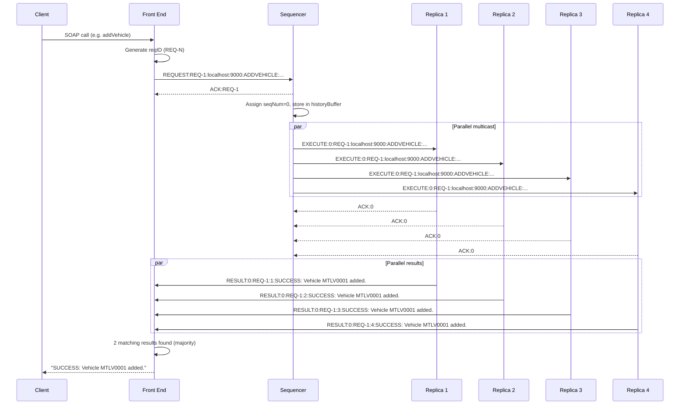

### 3.2 Step-by-Step Walkthrough

**Step 1 -- Client invocation.** The client calls a SOAP method on the FE (e.g. `addVehicle`). The FE exposes the same `@WebService` interface as the original A3 `VehicleReservationWS`.

**Step 2 -- FE forwards to Sequencer.** `forwardAndCollect` generates a unique `reqID` (`REQ-N`), creates a `RequestContext`, builds a `REQUEST` message, and sends it to `localhost:9100` via `ReliableUDPSender`.

**Step 3 -- Sequencer assigns order.** The Sequencer's `handleRequest` atomically increments `sequenceCounter`, builds an `EXECUTE` string with the sequence number prepended, stores it in `historyBuffer`, and multicasts to all replicas in parallel threads.

**Step 4 -- Replicas execute in order.** Each replica's `ExecutionGate` checks the sequence number:
- If `seqNum == nextExpectedSeq`: execute immediately, increment frontier, drain any buffered contiguous operations
- If `seqNum > nextExpectedSeq`: buffer in holdback queue, send `NACK` for the gap range
- If `seqNum < nextExpectedSeq`: duplicate, reply `ACK` only (idempotent)

**Step 5 -- Results to FE.** Each replica's `VehicleReservationWS.executeAndDeliver` sends a `RESULT` message to the FE's UDP port (9000) via `ReliableUDPSender`.

**Step 6 -- FE majority vote.** The FE's `RequestContext.addResult` checks if 2 results match. When the threshold is met, the `CompletableFuture` completes and the SOAP response is returned to the client. The FE also runs `processResults` to track Byzantine mismatches and detect crashed replicas.

---

## 4. Front End (FE) Component Design

**Source:** `src/main/java/server/FrontEnd.java`

### 4.1 Role

The FE is the single entry point for all clients. It provides **replication transparency** -- clients see a normal SOAP endpoint and are unaware of the 4 replicas behind it. The FE also serves as the **fault detector**: it identifies Byzantine mismatches and crash timeouts.

### 4.2 Internal Architecture

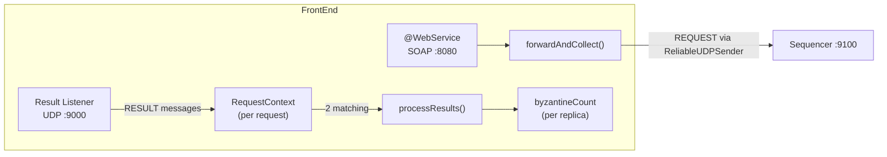

### 4.3 Key Data Structures

| Field | Type | Purpose |
|---|---|---|
| `pendingRequests` | `ConcurrentHashMap<String, RequestContext>` | Active requests awaiting majority |
| `byzantineCount` | `ConcurrentHashMap<String, AtomicInteger>` | Per-replica Byzantine strike counter |
| `slowestResponseTime` | `AtomicLong` (init 2000ms) | Adaptive timeout baseline |
| `requestCounter` | `AtomicInteger` | Monotonic request ID generator |
| `sender` | `ReliableUDPSender` | ACK-based reliable UDP sender |

### 4.4 RequestContext

Each SOAP call creates a `RequestContext` that holds:

- `requestID`: unique ID (`REQ-N`)
- `sentTime`: timestamp for adaptive timeout calculation
- `replicaResults`: `ConcurrentHashMap<replicaID, result>` collecting per-replica responses
- `majorityFuture`: `CompletableFuture<String>` that completes when 2 results match
- `seqNum`: sequence number from the first RESULT received

The `addResult` method checks for a majority after each result arrives. If `matchCount >= 2`, the future completes immediately.

### 4.5 Adaptive Timeout

The FE waits `2 * slowestResponseTime` for a majority. After each completed request, `slowestResponseTime` is updated to `max(prev, elapsed)`. This allows the system to adapt to varying network/processing delays.

If the majority future times out, the FE falls back to `vote()` which inspects whatever results arrived and attempts to find a 2-match majority. If none exists, it returns `"FAIL: No majority result"`.

### 4.6 Fault Detection

**Byzantine detection:** After each request, `processResults` compares every replica's result against the majority. Mismatches increment `byzantineCount` for that replica; matches reset it to 0. When a replica reaches **3 consecutive mismatches**, the FE broadcasts `REPLACE_REQUEST:<replicaID>:BYZANTINE_THRESHOLD` to all RMs.

**Crash detection:** For any replica that did not respond (absent from `ctx.replicaResults`), the FE sends `CRASH_SUSPECT:<reqID>:<seqNum>:<replicaID>` to all RMs.

### 4.7 WebService Interface

The FE exposes the same 8 SOAP methods as the original A3 service:

| Method | Operation String |
|---|---|
| `addVehicle` | `ADDVEHICLE:<mgrID>:<num>:<type>:<vehID>:<price>` |
| `removeVehicle` | `REMOVEVEHICLE:<mgrID>:<vehID>` |
| `listAvailableVehicle` | `LISTAVAILABLE:<mgrID>` |
| `reserveVehicle` | `RESERVE_EXECUTE:<custID>:<vehID>:<start>:<end>` |
| `updateReservation` | `ATOMIC_UPDATE_EXECUTE:<custID>:<vehID>:<start>:<end>` |
| `cancelReservation` | `CANCEL_EXECUTE:<custID>:<vehID>` |
| `findVehicle` | `FIND:<custID>:<type>` |
| `listCustomerReservations` | `LISTRES:<custID>` |
| `addToWaitList` | `WAITLIST:<custID>:<vehID>:<start>:<end>` |

---

## 5. Sequencer Component Design

**Source:** `src/main/java/server/Sequencer.java`

### 5.1 Role

The Sequencer is a **single, failure-free** process that provides **total ordering** of all operations. It assigns a globally unique, monotonically increasing sequence number to each request and reliably multicasts the ordered operation to all replicas.

### 5.2 Internal Architecture

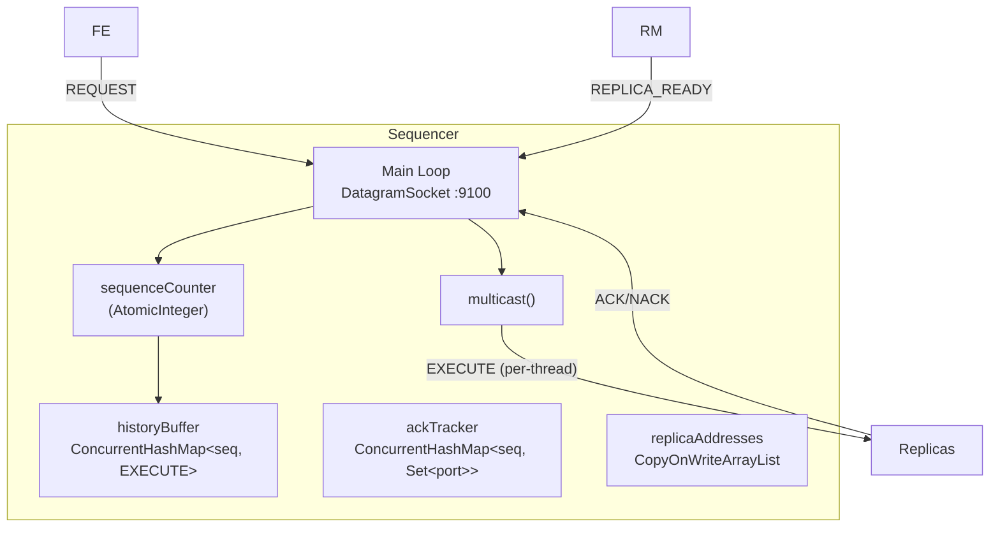

### 5.3 Key Data Structures

| Field | Type | Purpose |
|---|---|---|
| `sequenceCounter` | `AtomicInteger` (init 0) | Global sequence number generator |
| `historyBuffer` | `ConcurrentHashMap<Integer, String>` | Stores every EXECUTE for replay |
| `ackTracker` | `ConcurrentHashMap<Integer, KeySetView<Integer, Boolean>>` | Per-seq ACK tracking by source port |
| `replicaAddresses` | `CopyOnWriteArrayList<InetSocketAddress>` | Current multicast targets |
| `sender` | `ReliableUDPSender` | ACK-based reliable sender |

### 5.4 handleRequest

```
1. seqNum = sequenceCounter.getAndIncrement()
2. Build: "EXECUTE:<seqNum>:<reqID>:<feHost>:<fePort>:<operation>"
3. historyBuffer.put(seqNum, executeMsg)
4. ackTracker.put(seqNum, newKeySet())
5. multicast(executeMsg) to all replicaAddresses
```

### 5.5 Multicast

For each replica in `replicaAddresses`, a **new thread** opens a fresh `DatagramSocket` and calls `ReliableUDPSender.send`. If the send is not ACKed after retries, the Sequencer calls `notifyRmsCrashSuspectFor` which extracts the replica ID from the port and sends `CRASH_SUSPECT` to all RM ports.

### 5.6 handleNack

When a replica detects a gap (received seq 5 but expected seq 3), it sends `NACK:<replicaID>:3:4`. The Sequencer looks up sequence numbers 3 and 4 in `historyBuffer` and replays each as a separate thread to the requester's address/port.

### 5.7 handleReplicaReady

When an RM notifies that a replacement replica is ready:

1. Parse `lastSeqNum` from the message
2. Replay all EXECUTE messages from `lastSeq + 1` up to `sequenceCounter.get()` from `historyBuffer`
3. Update `replicaAddresses` (remove old entry for that port, add new one)
4. Send `ACK:REPLICA_READY:<replicaID>` back to the RM

---

## 6. Replica (RE) Component Design

**Sources:** `src/main/java/server/ReplicaLauncher.java`, `src/main/java/server/VehicleReservationWS.java`

### 6.1 Role

Each replica is a full copy of the three-office DVRMS business logic. It receives ordered `EXECUTE` messages from the Sequencer, applies them in total order, and sends results directly to the FE. In the P2 architecture, replicas have no SOAP endpoint -- all requests arrive via UDP from the Sequencer.

### 6.2 Internal Architecture

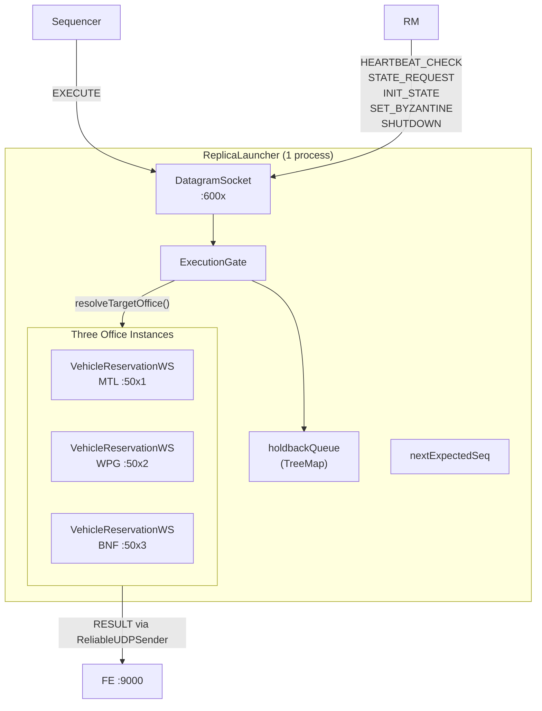

### 6.3 ExecutionGate

The `ExecutionGate` is a `synchronized` inner class that enforces total-order execution:

| Condition | Action |
|---|---|
| `seqNum == nextExpectedSeq` | Execute immediately, increment frontier, drain buffered contiguous ops |
| `seqNum > nextExpectedSeq` | Buffer in `holdbackQueue` (TreeMap), send `NACK:<replicaId>:<nextExpected>:<seqNum-1>` + `ACK:<seqNum>` |
| `seqNum < nextExpectedSeq` | Duplicate -- reply `ACK:<seqNum>` only (idempotent, no re-execution) |

**drainBufferedContiguous:** After executing a committed operation, the gate checks if the next expected seq is in the holdback queue. If so, it executes and repeats, draining all contiguous buffered operations.

### 6.4 Operation Routing

`extractTargetOffice(operation)` determines which of the three office instances handles each operation:

| Operation | Routing Rule |
|---|---|
| `ADDVEHICLE`, `REMOVEVEHICLE`, `LISTAVAILABLE` | Office from manager ID (field 1) |
| `RESERVE_EXECUTE`, `CANCEL_EXECUTE`, `ATOMIC_UPDATE_EXECUTE` | Office from customer ID (field 1) |
| `LISTRES` | Office from customer ID (field 1) |
| `FIND` | Default office (MTL) |
| `RESERVE`, `CANCEL`, `WAITLIST`, `ATOMIC_UPDATE` | Office from field 2 |

The office is extracted from the first 3 characters of the ID (e.g. `MTLM1111` -> `MTL`).

### 6.5 VehicleReservationWS (Business Logic)

Each `VehicleReservationWS` instance manages one office's data:

- `vehicleDB`: vehicle inventory
- `reservations`: per-vehicle reservation list
- `waitList`: per-vehicle waitlist entries
- `customerBudget` / `crossOfficeCount`: shared budget and cross-office quota enforcement (static, same JVM)

**executeCommittedSequence:** Called by `ExecutionGate` -- sets `nextExpectedSeq`, clears the local holdback queue, then delegates to `executeAndDeliver`.

**executeAndDeliver:** If `byzantineMode` is true, sends a fake `BYZANTINE_RANDOM_<nanotime>` result. Otherwise, calls `handleUDPRequest(operation)` for real business logic, then sends the `RESULT` to the FE via `ReliableUDPSender`.

### 6.6 State Snapshot

**getStateSnapshot:** Serializes `vehicleDB`, `reservations`, `waitList`, `customerBudget`, `crossOfficeCount`, and `nextExpectedSeq` into a Base64-encoded Java object stream.

**loadStateSnapshot:** Deserializes and replaces all in-memory state from a Base64 snapshot.

### 6.7 Message Handlers Summary

| Message | Handler Behavior |
|---|---|
| `EXECUTE` | Parse fields, delegate to `ExecutionGate.handleExecute`, send ACK/NACK replies |
| `HEARTBEAT_CHECK` | Reply `HEARTBEAT_ACK:<replicaId>:<nextExpectedSeq>` |
| `SHUTDOWN` | Print message, exit process (`return` from main) |
| `SET_BYZANTINE` | Toggle `byzantineMode` on all 3 offices, reply ACK |
| `STATE_REQUEST` | Collect snapshots from all 3 offices, send `STATE_TRANSFER` reliably |
| `INIT_STATE` | Load 3 office snapshots (split by `|`), reset `ExecutionGate`, reply ACK with lastSeqNum |

---

## 7. Replica Manager (RM) Component Design

**Source:** `src/main/java/server/ReplicaManager.java`

### 7.1 Role

Each RM is a supervisor for one co-located replica. Its four responsibilities are:

1. **Launch and monitor** the replica subprocess via heartbeats
2. **Participate in consensus** when faults are reported (Byzantine or crash)
3. **Replace** a faulty replica and coordinate state transfer
4. **Notify** the Sequencer, FE, and peer RMs when replacement is ready

### 7.2 Internal Architecture

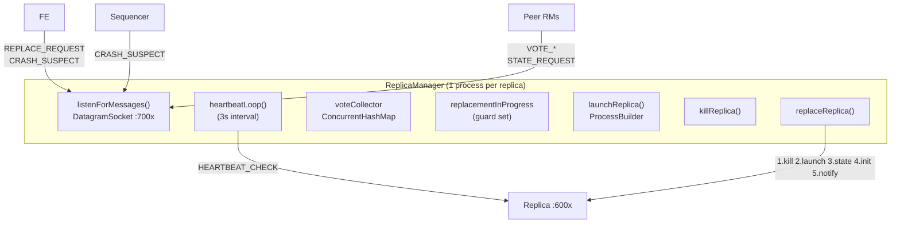

### 7.3 Key Data Structures

| Field | Type | Purpose |
|---|---|---|
| `replicaId` | `int` | 1--4, maps to ports via `PortConfig` |
| `replicaProcess` | `Process` | Co-located `ReplicaLauncher` subprocess |
| `voteCollector` | `ConcurrentHashMap<voteKey, ConcurrentHashMap<rmId, decision>>` | Aggregates votes from all RMs |
| `scheduledVoteEvaluation` | `KeySetView<String, Boolean>` | Ensures one evaluation thread per vote key |
| `replacementInProgress` | `KeySetView<String, Boolean>` | Prevents concurrent replacements for the same replica |
| `sender` | `ReliableUDPSender` | For reliable peer and Sequencer communication |

### 7.4 Heartbeat Monitoring

A dedicated thread sends `HEARTBEAT_CHECK:<replicaId>` to the co-located replica every 3 seconds with a 2-second timeout. Heartbeat failures are **logged only** -- they do not automatically trigger replacement. Replacement is driven by FE/Sequencer fault reports + RM consensus.

### 7.5 Vote System

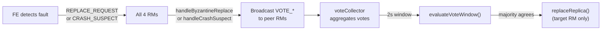

**Vote key format:** `VOTE_BYZANTINE:<targetId>` or `VOTE_CRASH:<targetId>`

**Byzantine vote:** When a `REPLACE_REQUEST` arrives, each RM broadcasts `VOTE_BYZANTINE:<targetId>:<voterId>` (implicit AGREE).

**Crash vote:** When a `CRASH_SUSPECT` arrives, each RM independently heartbeats the suspected replica's port, then broadcasts `VOTE_CRASH:<targetId>:<ALIVE|CRASH_CONFIRMED>:<voterId>`.

**Self-vote:** Each RM records its own vote locally via `handleVote(UDPMessage.parse(vote), socket)` to avoid `ReliableUDPSender` deadlock on the listener thread.

**Evaluation:** After a 2-second window (`VOTE_WINDOW_MS`), a daemon thread evaluates: if `agreeCount > totalVotes / 2` (strict majority among received votes), and `targetId` matches this RM's `replicaId`, then `replaceReplica()` is called.

### 7.6 replaceReplica Workflow

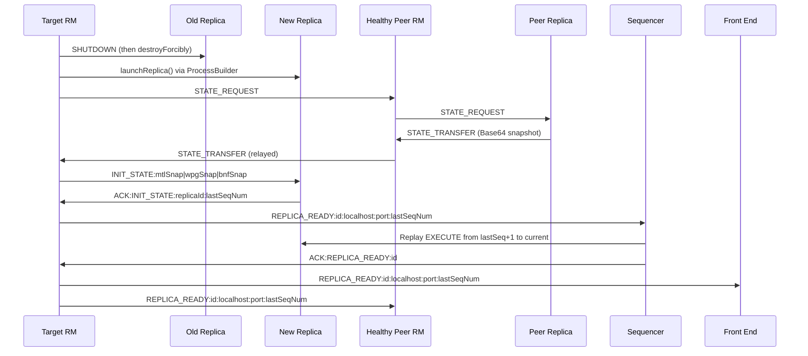

**Step 1 -- Kill.** Send `SHUTDOWN` UDP to the old replica, then `destroyForcibly()` the process.

**Step 2 -- Launch.** `ProcessBuilder` spawns `java server.ReplicaLauncher <replicaId>` with the same classpath.

**Step 3 -- Request state.** Iterates through all peer RMs (lowest ID first, skipping self), sends `STATE_REQUEST`. The peer RM forwards to its co-located replica, receives `STATE_TRANSFER`, and relays it back.

**Step 4 -- Initialize.** Sends `INIT_STATE:<mtlSnap>|<wpgSnap>|<bnfSnap>` to the new replica with a retry loop (5 retries, exponential backoff). The replica loads all 3 office states, resets its `ExecutionGate`, and replies `ACK:INIT_STATE:<replicaId>:<lastSeqNum>`.

**Step 5 -- Notify.** Sends `REPLICA_READY:<replicaId>:localhost:<port>:<lastSeqNum>` to the Sequencer (triggers catch-up replay), the FE, and all peer RMs.

### 7.7 Message Handlers Summary

| Message | Handler |
|---|---|
| `REPLACE_REQUEST` | `handleByzantineReplace` -- broadcast `VOTE_BYZANTINE` |
| `CRASH_SUSPECT` | `handleCrashSuspect` -- heartbeat suspected replica, broadcast `VOTE_CRASH` |
| `VOTE_BYZANTINE` / `VOTE_CRASH` | `handleVote` -- collect in `voteCollector`, schedule evaluation |
| `STATE_REQUEST` | `handleStateRequest` -- forward to replica, relay snapshot back |

---

## 8. Failure Simulation Design

### 8.1 Byzantine Fault

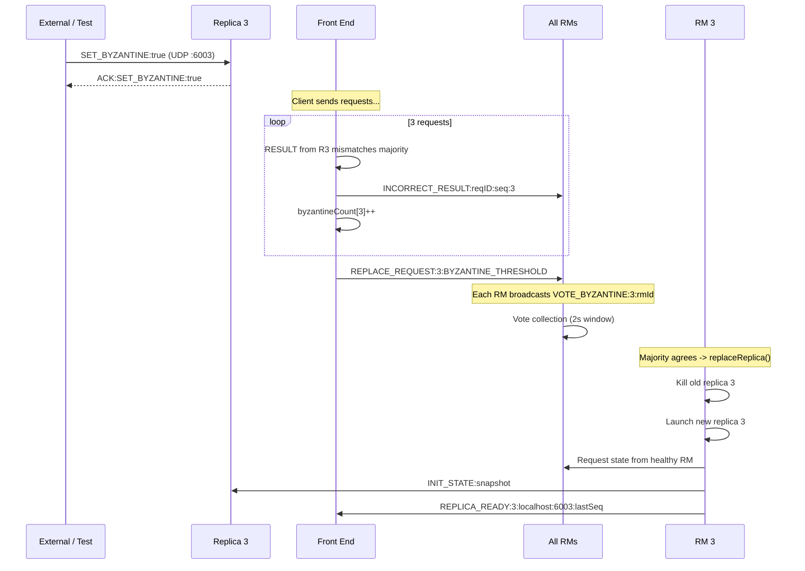

**Injection:** Send `SET_BYZANTINE:true` via raw UDP to the target replica's port. This sets `byzantineMode = true` on all 3 office instances within that replica.

**Effect:** `VehicleReservationWS.executeAndDeliver` skips business logic and returns `BYZANTINE_RANDOM_<nanotime>` -- a guaranteed mismatch against correct replicas.

**Detection:** The FE's `processResults` increments `byzantineCount` for each mismatch. After 3 consecutive mismatches, `REPLACE_REQUEST` is broadcast. Single mismatches followed by a correct result reset the counter to 0.

**Recovery:** RM consensus (VOTE_BYZANTINE) + replaceReplica workflow (kill, launch, state transfer, REPLICA_READY, Sequencer replay).

### 8.2 Crash Fault

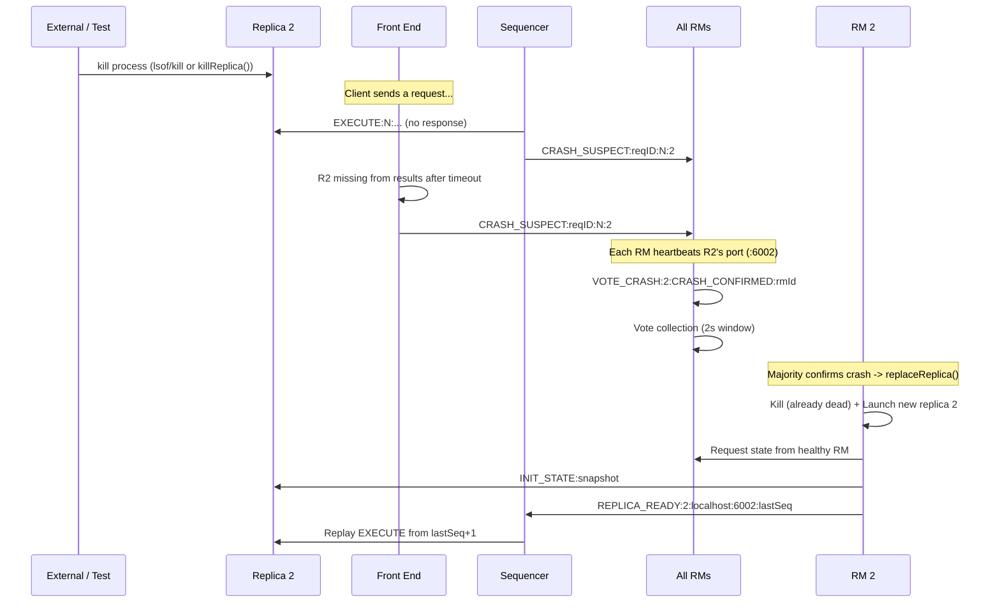

**Injection:** Kill the replica process externally (`lsof -ti udp:600x | xargs kill`) or programmatically via `ReplicaManager.killReplica()`.

**Detection (two paths):**

1. **Sequencer path:** When `ReliableUDPSender` exhausts retries during multicast, `notifyRmsCrashSuspectFor` sends `CRASH_SUSPECT` to all RMs.
2. **FE path:** When a replica is missing from `ctx.replicaResults` after majority/timeout, the FE sends `CRASH_SUSPECT` to all RMs.

**Verification:** Each RM independently heartbeats the suspected replica's port. If no `HEARTBEAT_ACK` within 2 seconds, the RM votes `CRASH_CONFIRMED`; otherwise `ALIVE`.

**Recovery:** Same replaceReplica workflow as Byzantine recovery.

### 8.3 Simultaneous Fault (Byzantine + Crash)

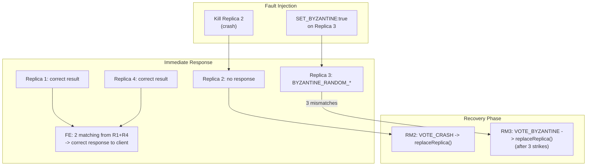

**Immediate tolerance:** With 1 crash + 1 Byzantine, only 2 healthy replicas respond. Both return the same correct result, meeting `f+1 = 2`. The client receives the correct response without delay.

**Dual recovery:** Crash and Byzantine recovery workflows execute independently on their respective RMs. The `replacementInProgress` guard is keyed by `targetId`, so replacements for different replicas can proceed concurrently while preventing duplicate replacement of the same replica.

### 8.4 Reliability Layer

**ReliableUDPSender** provides application-level reliability over UDP:

| Parameter | Value |
|---|---|
| Initial timeout | 500 ms |
| Max retries | 5 |
| Backoff strategy | Exponential (500, 1000, 2000, 4000, 8000 ms) |
| ACK format | Any response starting with `ACK:` |
| Failure behavior | Returns `false`; caller decides escalation |

**Usage map:**

| Sender | Receiver | On failure |
|---|---|---|
| FE | Sequencer | Return `"FAIL: Could not reach Sequencer"` |
| Sequencer | Each Replica | `CRASH_SUSPECT` to all RMs |
| Replicas | FE | Log error (FE has timeout fallback) |
| RM | Peer RMs (votes) | Log error (vote window uses received votes only) |
| RM | Sequencer (REPLICA_READY) | Log error |
| RM | New Replica (INIT_STATE) | Custom retry loop (5 retries, exponential) |

**Holdback queue + NACK:** The replica-side `ExecutionGate` provides an additional ordering guarantee. If an EXECUTE arrives out of order (gap), the replica buffers it and sends a `NACK` range to the Sequencer, which replays from `historyBuffer`. This handles UDP reordering and the case where one multicast thread completes before another.

---

## 9. Demo Scenarios Reference

### 9.1 Scenario Summary

| Scenario | Fault | Injection Command | What to Observe |
|---|---|---|---|
| **A: Byzantine** | Replica 3 returns wrong results | `echo -n "SET_BYZANTINE:true" \| nc -u -w1 localhost 6003` | Client still succeeds; after 3 requests, RM3 replaces replica; Sequencer replays |
| **B: Crash** | Replica 2 process killed | `kill $(lsof -ti udp:6002 \| head -n1)` | Client still succeeds; RM2 detects crash via vote; state transfer + replay |
| **C: Simultaneous** | Crash R2 + Byzantine R3 | Kill R2 process + SET_BYZANTINE on R3 | Immediate correct response from 2 healthy; both recoveries proceed independently |

### 9.2 Startup Sequence

```bash
mvn clean compile

# Terminal 1: Sequencer
java -cp target/classes server.Sequencer

# Terminals 2-5: Replica Managers (each launches its own replica)
java -cp target/classes server.ReplicaManager 1
java -cp target/classes server.ReplicaManager 2
java -cp target/classes server.ReplicaManager 3
java -cp target/classes server.ReplicaManager 4

# Terminal 6: Front End
java -cp target/classes server.FrontEnd

# Terminal 7: Client
./build-client.sh --wsdl http://localhost:8080/fe?wsdl
java -cp bin client.ManagerClient --wsdl http://localhost:8080/fe?wsdl
```

### 9.3 Expected Log Checkpoints

| Component | Log Pattern | Meaning |
|---|---|---|
| RM | `Byzantine replace requested for 3` | FE reported Byzantine threshold |
| RM | `Starting replica replacement` | Vote passed, replacement beginning |
| RM | `State transfer complete, lastSeq=N` | Snapshot loaded into new replica |
| Sequencer | `3 ready, replaying from seq N` | Catch-up replay triggered |
| FE | Client returns success (not `FAIL`) | System handled fault transparently |

### 9.4 Integration Test Mapping

| ID Range | Category | Key Tests |
|---|---|---|
| T1--T5 | Normal operations | Vehicle CRUD, reservations, cross-office, concurrent, waitlist |
| T6--T10 | Byzantine faults | 1/2/3 consecutive faults, replacement + recovery, counter reset |
| T11--T14 | Crash faults | Timeout detection, RM consensus, state transfer, requests during recovery |
| T15--T17 | Simultaneous | Byzantine + crash together, dual recovery, state consistency |
| T18--T21 | Edge cases | Retransmission, holdback ordering, concurrent clients, full cross-office |

```bash
# Byzantine tests
mvn -q -Dtest=integration.ReplicationIntegrationTest#t6_byzantineFirstStrike+t7_byzantineSecondStrike+t8_byzantineThirdStrikeReplace test

# Crash tests
mvn -q -Dtest=integration.ReplicationIntegrationTest#t11_crashDetection+t12_crashRecovery test

# Simultaneous test
mvn -q -Dtest=integration.ReplicationIntegrationTest#t15_crashPlusByzantine test
```

---

## 10. Port Map and Process Topology

### 10.1 Complete Port Assignment

| Component | Protocol | Port(s) | Source |
|---|---|---|---|
| FE (SOAP) | TCP | 8080 | `PortConfig.FE_SOAP` |
| FE (UDP results) | UDP | 9000 | `PortConfig.FE_UDP` |
| Sequencer | UDP | 9100 | `PortConfig.SEQUENCER` |
| Replica 1 | UDP | 6001 | `PortConfig.REPLICA_1` |
| Replica 2 | UDP | 6002 | `PortConfig.REPLICA_2` |
| Replica 3 | UDP | 6003 | `PortConfig.REPLICA_3` |
| Replica 4 | UDP | 6004 | `PortConfig.REPLICA_4` |
| RM 1 | UDP | 7001 | `PortConfig.RM_1` |
| RM 2 | UDP | 7002 | `PortConfig.RM_2` |
| RM 3 | UDP | 7003 | `PortConfig.RM_3` |
| RM 4 | UDP | 7004 | `PortConfig.RM_4` |
| R1 MTL office | UDP | 5001 | `officePort(1, "MTL")` |
| R1 WPG office | UDP | 5002 | `officePort(1, "WPG")` |
| R1 BNF office | UDP | 5003 | `officePort(1, "BNF")` |
| R2 MTL office | UDP | 5011 | `officePort(2, "MTL")` |
| R2 WPG office | UDP | 5012 | `officePort(2, "WPG")` |
| R2 BNF office | UDP | 5013 | `officePort(2, "BNF")` |
| R3 MTL office | UDP | 5021 | `officePort(3, "MTL")` |
| R3 WPG office | UDP | 5022 | `officePort(3, "WPG")` |
| R3 BNF office | UDP | 5023 | `officePort(3, "BNF")` |
| R4 MTL office | UDP | 5031 | `officePort(4, "MTL")` |
| R4 WPG office | UDP | 5032 | `officePort(4, "WPG")` |
| R4 BNF office | UDP | 5033 | `officePort(4, "BNF")` |

**Office port formula:** `5001 + (replicaId - 1) * 10 + officeOffset` where MTL=0, WPG=1, BNF=2.

### 10.2 Process Topology

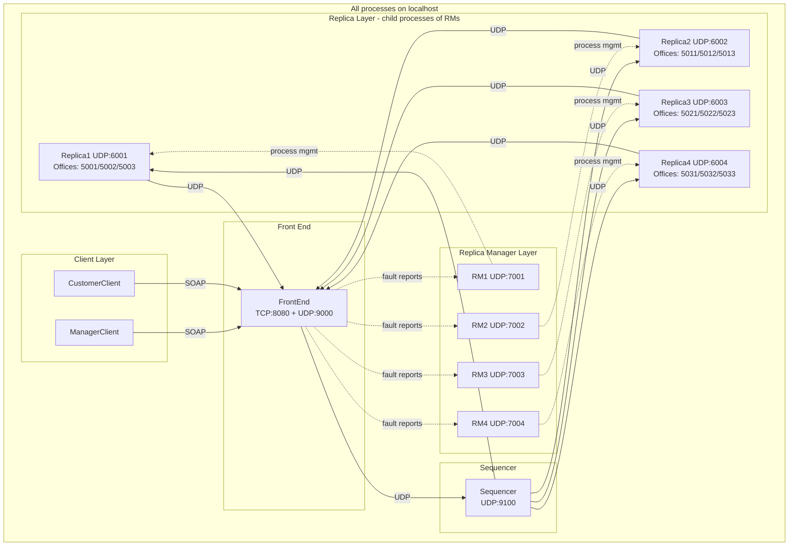

**Total processes at runtime:** 10 (1 FE + 1 Sequencer + 4 RMs + 4 Replicas). Each RM spawns its replica as a child process via `ProcessBuilder`.

---

## Source File Index

| File | Role |
|---|---|
| `src/main/java/server/PortConfig.java` | All port constants and the office port formula |
| `src/main/java/server/UDPMessage.java` | Wire protocol: message type enum, parse/serialize |
| `src/main/java/server/ReliableUDPSender.java` | ACK-based reliable UDP with exponential backoff |
| `src/main/java/server/FrontEnd.java` | SOAP endpoint, Sequencer forwarding, majority voting, fault detection |
| `src/main/java/server/Sequencer.java` | Total-order assignment, reliable multicast, history replay |
| `src/main/java/server/ReplicaLauncher.java` | Replica process entry point, ExecutionGate, message dispatch |
| `src/main/java/server/VehicleReservationWS.java` | Business logic, holdback queue, snapshot, Byzantine mode |
| `src/main/java/server/ReplicaManager.java` | Replica lifecycle, heartbeat, vote consensus, state transfer |
| `src/main/java/model/Vehicle.java` | Vehicle data model |
| `src/main/java/model/Reservation.java` | Reservation data model |
| `src/main/java/client/ManagerClient.java` | Interactive SOAP manager client |
| `src/main/java/client/CustomerClient.java` | Interactive SOAP customer client |
| `src/test/java/integration/ReplicationIntegrationTest.java` | End-to-end test suite (T1--T21) |
